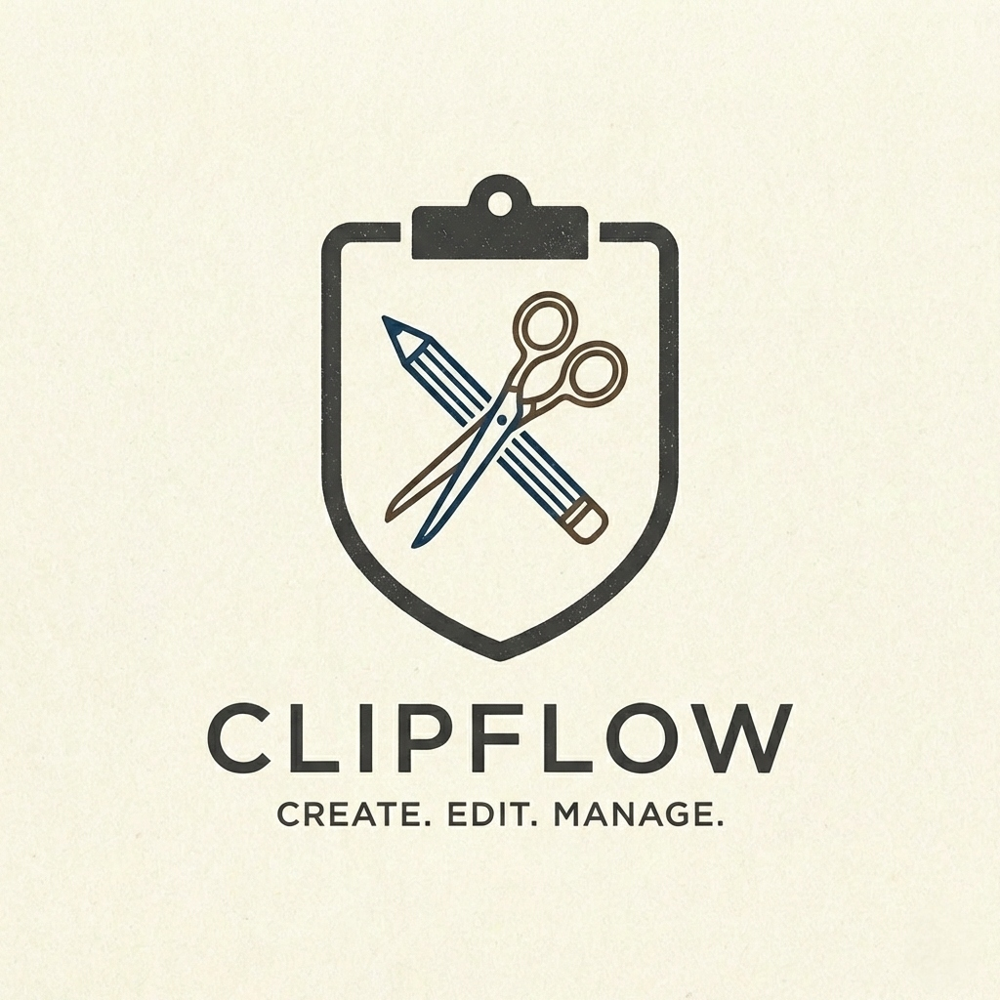
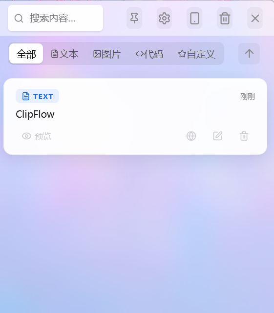
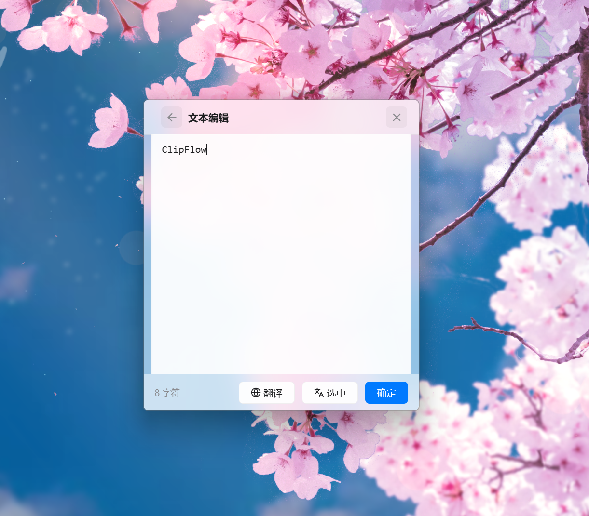
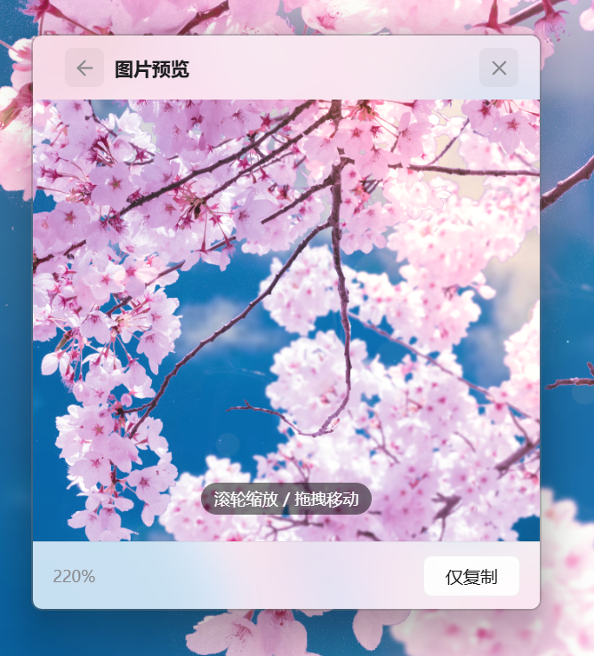
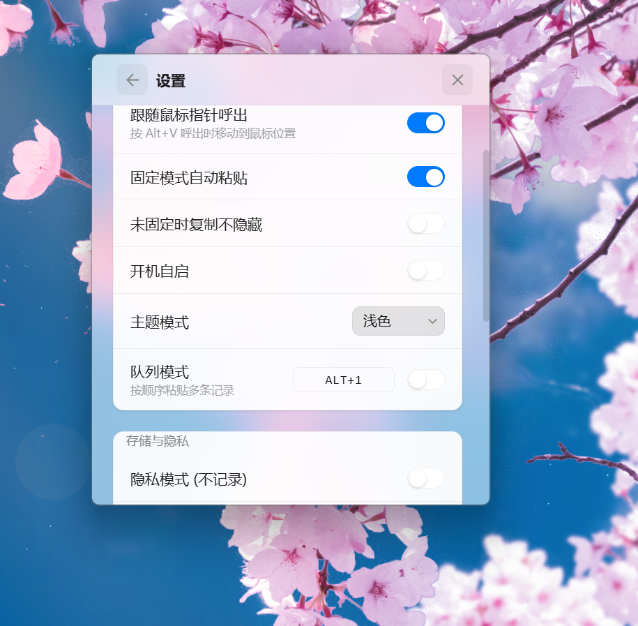

<div align="center">



# ClipFlow

**让剪贴板真正流动起来**

把复制、查看、翻译、同步、恢复串成一条顺手的桌面工作流，<br />而不只是保存"你刚刚复制过什么"。


</div>

---

## Why ClipFlow?

大多数剪贴板工具只解决一件事：**"我刚刚复制过什么？"**

ClipFlow 想解决的是另一类问题：

- 复制完之后，能不能**立即回写 / 粘贴**？
- 多条内容能不能按顺序**队列粘贴**？
- 图片和长文本能不能在应用内**直接查看与编辑**？
- 临时需要时，能不能快速**翻译**？
- 手机和电脑之间，能不能在同一局域网里**顺手互传**？
- 系统休眠、监听异常后，工具能不能**自己恢复**？

ClipFlow 围绕的不是"剪贴板"本身，而是一个更完整的 **clipboard workflow**。

---

## Highlights

| | |
|---|---|
| ⚡ **Win32 event-driven monitor** | 使用 `AddClipboardFormatListener`，非轮询 |
| 🧠 **History + category** | 文本 / 图片 / 代码，支持分类与搜索 |
| 📌 **Copy / paste / queue** | 快速复制、自动粘贴、队列模式 |
| 🖼️ **Built-in viewer** | 文本可编辑，图片可缩放拖拽 |
| 🌐 **Translation** | 全文翻译、选中翻译，Rust 后端调用 |
| 📱 **Phone sync** | 局域网二维码入口，支持文本/图片/文件互传 |
| 🛠️ **Stability & recovery** | 休眠恢复、supervisor 自动重启、force sync |
| 🎨 **Theme support** | 跟随系统 / 浅色 / 深色 |

---

## 界面截图

### 主界面 — 历史记录与分类筛选

<p align="center">
  
</p>

### 查看器 — 文本编辑与图片浏览

<table>
  <tr>
    <td align="center" width="50%">
      
      <br />
      <sub>文本内容的独立查看与编辑</sub>
    </td>
    <td align="center" width="50%">
      
      <br />
      <sub>图片内容的缩放与拖拽浏览</sub>
    </td>
  </tr>
</table>

### 手机同步 — 局域网手机互传

<table>
  <tr>
    <td align="center" width="33.33%">
      
      <br />
      <sub>扫码接入局域网同步</sub>
    </td>
    <td align="center" width="33.33%">
      
      <br />
      <sub>桌面端的同步会话视图</sub>
    </td>
    <td align="center" width="33.33%">
      
      <br />
      <sub>手机端 Web UI</sub>
    </td>
  </tr>
</table>

---

## 功能概览

### 剪贴板历史

- 自动捕获文本、代码、图片等剪贴板内容
- 数据持久化到本地 SQLite
- 支持搜索、分类浏览、编辑分类、自定义标签、删除、清空

### 复制 / 粘贴工作流

- 单击即可快速复制回剪贴板
- 支持固定模式、自动粘贴、未固定时复制不隐藏
- 支持**队列模式**，适合批量粘贴、表单录入、重复性填充工作

### 查看器模式

- 文本内容支持独立查看、编辑、保存
- 图片内容支持缩放、拖拽浏览
- 查看器内保留复制与翻译入口

### 翻译

- 全文翻译 / 还原
- 选中片段翻译 / 取消
- Rust 后端负责调用翻译服务，前端保持轻交互层

### 手机同步

- 应用内生成局域网二维码
- 手机可通过 Web UI 接入桌面端
- 支持文本、图片、文件收发

### 设置

- 主题模式（跟随系统 / 浅色 / 深色）
- 队列模式与快捷键配置
- 隐私模式（暂停记录）
- 历史记录上限、文件接收位置、服务端口
- 唤醒快捷键、开机自启、跟随鼠标指针呼出等行为开关

### 稳定性与恢复

- 休眠唤醒后的监听恢复
- `force_sync` 手动强制同步
- 监听线程 supervisor 自动恢复
- 防止已删除内容被错误重建的"幽灵复活"保护

---

## Quick Start

### Requirements

- Node.js &ge; 18
- Rust &ge; 1.70
- Windows 10+ 开发环境
- [Tauri v2 prerequisites](https://v2.tauri.app/start/prerequisites/)

### Run locally

```bash
# 1. 克隆仓库
git clone [https://github.com/fgsaw16-byte/clipflow.git](https://github.com/fgsaw16-byte/clipflow.git)

# 2. 进入目录并安装前端依赖
cd clipflow
npm install
npm run tauri dev
```

### Common commands

```bash
# Frontend only
npm run dev           # Vite dev server (port 1420)
npm run build         # Type-check + bundle

# Full desktop app
npm run tauri dev     # Development mode
npm run tauri build   # Production build

# Rust backend (run inside src-tauri/)
cargo check           # Fast type check
cargo build --release # Release binary
cargo clippy          # Lints
```

---

## Architecture

### Frontend — React 19 + TypeScript

已从单体 `App.tsx` 重构为模块化结构：

```text
src/
├── App.tsx          # 组合根
├── App.css          # 全局样式
├── types/  constants/  lib/
├── utils/  api/  hooks/
└── components/
    └── views/
```

### Backend — Rust + Tauri v2

SQLite 持久化 + Actix-web 手机同步 + Win32 系统集成：

```text
src-tauri/src/
├── lib.rs       # 启动入口
├── state.rs     # 共享状态
├── db.rs        # SQLite
├── window.rs    # 窗口 & 托盘
├── clipboard/   # 监听 & 读写
├── commands/    # 23 个 Tauri 命令
└── server/      # Actix-web 手机同步
```

**Core stack**: Tauri v2 · React 19 · TypeScript · Vite · Framer Motion · Rust · Actix-web · SQLite (`rusqlite`) · Win32 APIs

---

## Project Status

### Recently completed

- ✅ 前后端模块化重构
- ✅ 主题模式选择器 (Settings)
- ✅ README 展示头部 & 截图画廊
- ✅ 14/14 功能验证通过

### Validation

```bash
npx tsc --noEmit    # Frontend type check
npm run build       # Frontend build
cargo check         # Rust type check
```

> 项目暂无自动化测试框架，变更后以上述命令 + 手动验证为准。

---

## Roadmap

- [ ] 使用演示 GIF 补齐
- [ ] 前端测试体系（Vitest / component tests）
- [ ] Rust 后端测试补充
- [ ] 更强的历史搜索与过滤
- [ ] 更完整的手机端交互体验
- [ ] 队列模式与自动粘贴工作流打磨
- [ ] 设置项导入导出

---

## Contributing

欢迎提交 Issue 或 PR。参与修改前建议了解：

1. 前端已模块化 — **不要把新逻辑堆回 `App.tsx`**
2. 后端 Win32 功能依赖 `#[cfg(target_os = "windows")]` 守卫，勿删
3. 项目对交互连续性和行为稳定性敏感，重构优先保证不回退
4. 手机端页面位于 `src-tauri/src/server/mobile.html`
5. 详细结构文档见 [`AGENTS.md`](./AGENTS.md)，修改日志见 [`CHANGELOG.md`](./CHANGELOG.md)

---

<div align="center">

ClipFlow 不是为了"功能列表更长"而存在，<br />
而是让桌面端复制/粘贴这件高频小事，变得更顺、更稳、更少打断。

</div>
